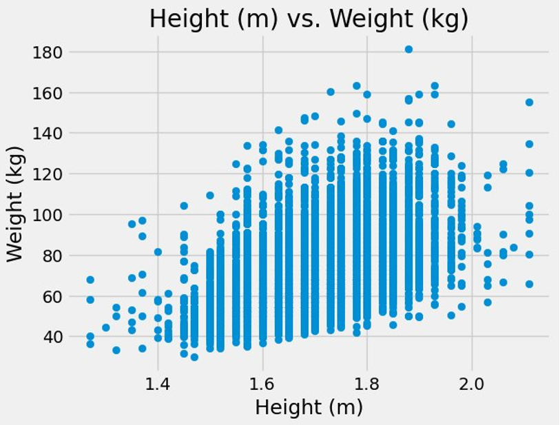
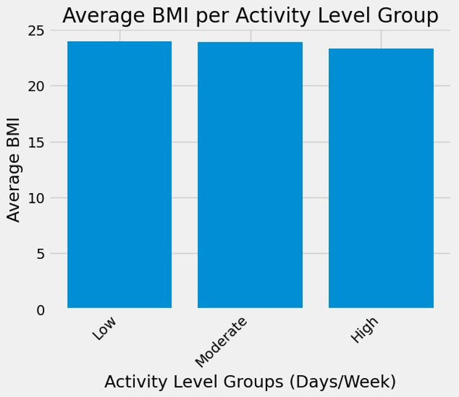

# Analyzing BMI and Physical Activity Patterns in Students

A data analysis and visualization project exploring the relationship between physical activity and BMI among students using two datasets.

**Authors:** Arianna Childs and Halden Kerzner  
**Course:** CS 260 — Database and Data Visualization  
**Semester:** Spring 2026

## Project Overview

This project investigates whether physical activity may help explain differences in BMI and body composition among students.

Using data from the **Youth Risk Behavior Surveillance System (YRBSS)** and the **Student Physical Education Performance dataset from Kaggle**, we analyzed relationships between height, weight, BMI, and physical activity.

The analysis focused on three main questions:

- What relationship exists between student height and weight?
- How does BMI vary between students with low, moderate, and high levels of physical activity?
- Do similar BMI and physical activity patterns appear across two different student datasets?

## Project Presentation

[View the Final Project Presentation](Final%20Project%20Presentation.pdf)

## Datasets

### Youth Risk Behavior Surveillance System (YRBSS)

The primary dataset contains 13,583 student records and includes demographic, behavioral, and physical health variables.

For this project, the primary variables analyzed were:

- Height
- Weight
- Days physically active per week
- BMI calculated from height and weight

Dataset:  
https://www.openintro.org/data/index.php?data=yrbss

### Student Physical Education Performance Dataset

A second dataset from Kaggle was used to compare the results found in the YRBSS data.

This dataset contains student BMI measurements and physical activity measured in hours per week.

Dataset:  
https://www.kaggle.com/datasets/ziya07/student-physical-education-performance

## Technologies Used

- Python
- SQL
- SQLite
- Pandas
- NumPy
- Matplotlib
- Jupyter Notebook

## Analysis

### Height vs. Weight
plt.savefig("height-vs-weight.png", dpi=300, bbox_inches="tight")

We first examined the relationship between student height and weight.

The analysis found a correlation coefficient of approximately **0.51**, indicating a moderate positive relationship between height and weight. However, students of similar heights still showed considerable variation in weight, suggesting that height alone does not fully explain differences in body composition.

### BMI and Physical Activity — YRBSS

Students were divided into three physical activity groups based on the number of days they were active per week:

- **Low:** 0–2 days
- **Moderate:** 3–4 days
- **High:** 5–7 days

Average BMI was calculated for each group using SQL. Histograms were then used to examine the distribution of BMI within each activity level.

Although average BMI values were relatively similar between groups, the distributions showed differences that averages alone did not capture. The low-activity group contained more extreme high-BMI values.

### BMI and Physical Activity — Kaggle Dataset

The second dataset was analyzed using physical activity measured in hours per week:

- **Low:** Less than 4 hours
- **Moderate:** 4–7 hours
- **High:** 7 or more hours

Similar to the YRBSS results, average BMI differed only slightly between activity groups. The distributions also showed that most participants had BMI values within a similar range, with some higher-BMI outliers.

### Comparing Both Datasets

SQL tables containing average BMI by activity group were created for both datasets and joined by activity level.

The comparison showed similar overall patterns across the two datasets. Higher physical activity levels were generally associated with slightly lower average BMI, although the differences were relatively small.

## Key Findings

- Height and weight showed a **moderate positive correlation of approximately 0.51**.
- Height alone did not fully explain differences in student body composition.
- Average BMI was relatively similar across physical activity groups.
- Lower-activity groups showed more high-BMI outliers in the distributions.
- Both datasets showed similar overall patterns between physical activity and BMI.
- Physical activity may contribute to differences in BMI, but activity level alone does not fully explain an individual's BMI.

## Limitations and Future Work

BMI has limitations as a measure of body composition because it does not distinguish between fat mass and lean body mass.

Future analysis could incorporate additional variables such as:

- Diet
- Exercise intensity
- Exercise duration
- Body fat percentage
- Additional lifestyle factors

Including these factors could provide a more complete understanding of the relationship between physical activity and body composition.

## My Contributions

My contributions to the project included:

- Developing the height-versus-weight analysis and calculating its correlation
- Creating visualizations for the height and weight relationship
- Developing the BMI and physical activity analyses for the YRBSS dataset
- Developing the BMI and physical activity analyses for the Kaggle dataset
- Creating BMI distribution visualizations for activity groups
- Comparing BMI patterns across both datasets
- Creating the cross-dataset comparison visualization
- Interpreting and documenting the results of these analyses

## Repository Contents

- `FinalReport_SP26_HK_AC.ipynb` — Complete Jupyter Notebook containing the SQL queries, Python analysis, visualizations, and project findings
- `yrbss.csv` — YRBSS dataset used in the analysis
- `student_pe_performance.csv` — Student Physical Education Performance dataset used for comparison
